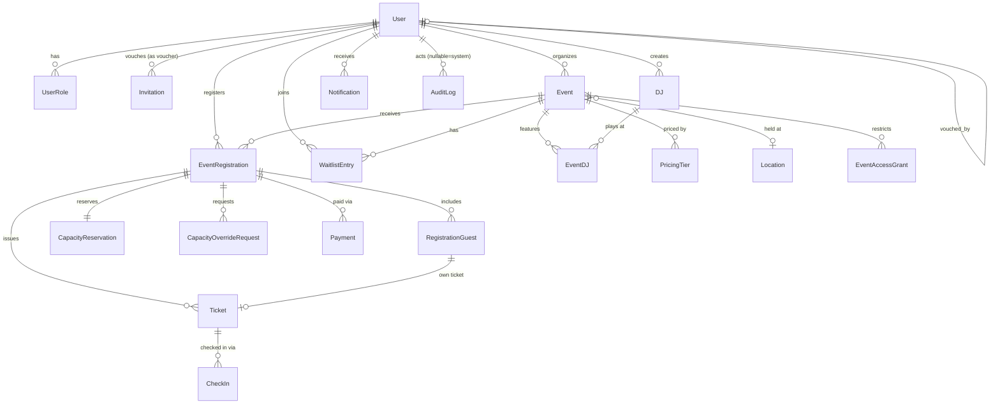

# 4. Database Schema

Conventions: `id` = UUID (`gen_random_uuid()`), all tables have `created_at`,
`updated_at`; soft-delete via `deleted_at` (nullable) only on tables users directly
manage (`User`, `Event`, `DJ`, `Location`) — transactional/history tables
(`Registration`, `Payment`, `Ticket`, `AuditLog`, `CheckIn`) are **never soft-deleted**,
only status-transitioned, to preserve history integrity. All timestamps `timestamptz`.

## 4.1 Core tables (abbreviated column lists — types/constraints noted)

**User**
`id, telegram_user_id (bigint, unique, not null), telegram_username (text, nullable), first_name, last_name, locale (enum: en|fa, default en), status (enum: PENDING|APPROVED|REJECTED|SUSPENDED), vouched_by_user_id (fk→User, nullable), invited_at, approved_at, created_at, updated_at, deleted_at`

**Role** — static lookup table: `ADMIN | ORGANIZER | VOUCHER`

**UserRole** (join): `user_id, role, granted_by_user_id, granted_at` — PK `(user_id, role)`

**Invitation**
`id, voucher_user_id (fk→User), invited_telegram_user_id (bigint, nullable — may not have accepted/exist yet), invited_telegram_username (nullable), status (enum: PENDING|ACCEPTED|REVOKED), token (unique, for deep link), created_at, accepted_at, accepted_user_id (fk→User, nullable)`

**DJ**
`id, name, photo_key, instagram, telegram_username, genre, bio, created_by_user_id (fk→User), created_at, updated_at, deleted_at`

**Location**
`id, venue_name, address, google_maps_url, latitude, longitude, metadata (jsonb), created_by_user_id, created_at, updated_at, deleted_at`

**Event**
`id, organizer_id (fk→User), name, description, cover_image_key, category, dress_code, age_restriction (bool), min_age (int, nullable), rules (text), location_id (fk→Location, nullable), start_at (timestamptz), end_at (timestamptz), capacity (int), price (numeric(10,2) — base/default price, used only if no PricingTier rows exist, D16), currency (char(3), default configured), max_people_per_registration (int), approval_required (bool), status (enum: see §2.1), visibility_mode (enum: ALL_APPROVED|SELECTED_USERS|SELECTED_VOUCHERS|INVITE_ONLY), location_released_at (timestamptz, nullable — one-way), notify_on_edit_default (bool), created_at, updated_at, deleted_at`

**EventDJ** (join): `event_id, dj_id` — PK composite. (`set_order int, nullable` reserved column for future set-time ordering.)

**PricingTier** — D16, optional, multiple rows per event
`id, event_id (fk), name (text, e.g. "Early Bird" — organizer-facing label, optional), price (numeric(10,2)), currency, starts_at (timestamptz), sort_order (int, ascending = chronological order), created_at, updated_at`

No `ends_at` column by design — a tier's effective end is derived at read time as
`MIN(next tier's starts_at, event.start_at)`, computed via a window function
(`LEAD(starts_at) OVER (PARTITION BY event_id ORDER BY starts_at)`), so tiers can never
gap or overlap. Unique constraint: `(event_id, starts_at)`. The "currently active price"
resolver is one query:

```sql
SELECT price, currency FROM (
  SELECT price, currency, starts_at,
         LEAD(starts_at) OVER (ORDER BY starts_at) AS next_starts_at
  FROM "PricingTier" WHERE event_id = $eventId
) t
WHERE starts_at <= now()
  AND (next_starts_at IS NULL OR now() < next_starts_at)
ORDER BY starts_at DESC LIMIT 1;
-- fallback to Event.price/currency if this returns no row (no tiers defined,
-- or now() is before the first tier's starts_at)
```

**EventAccessGrant** — realizes D4 (SELECTED_USERS / SELECTED_VOUCHERS / INVITE_ONLY explicit grants)
`id, event_id (fk), grant_type (enum: USER|VOUCHER_INVITEES), subject_user_id (fk→User, nullable), granted_by_user_id, created_at` — unique `(event_id, grant_type, subject_user_id)`

**EventRegistration**
`id, event_id (fk), primary_user_id (fk→User), people_count (int), status (enum, §2.2), price_snapshot (numeric), currency, approval_decided_by_user_id (nullable), approval_decided_at, expires_at (timestamptz, nullable — for PENDING_PAYMENT timer), created_at, updated_at`

Guests, capacity, tickets, and check-ins all cascade from this table.

**RegistrationGuest**
`id, registration_id (fk), first_name, last_name, telegram_user_id (bigint, nullable), telegram_username (nullable), linked_user_id (fk→User, nullable — D7), created_at`

**CapacityReservation** — see §4.3, this is the concurrency-safety table
`id, event_id (fk), registration_id (fk, unique — one reservation per registration), people_count (int), status (enum: ACTIVE|RELEASED), created_at, released_at`

**CapacityOverrideRequest** — D9
`id, registration_id (fk), requested_extra_people (int), status (enum: PENDING|APPROVED|REJECTED), decided_by_user_id, decided_at, created_at`

**WaitlistEntry**
`id, event_id (fk), user_id (fk→User), people_count (int), position (int, sequence per event), status (enum: JOINED|OFFERED|CLAIMED|EXPIRED|LEFT), offer_expires_at (nullable), created_at, updated_at`

**Payment**
`id, registration_id (fk, unique per attempt — see below), amount, currency, provider, provider_transaction_id (nullable, unique when set), status (enum §2.3), attempt_number (int), raw_provider_payload (jsonb), created_at, paid_at, failed_at, refund_status (enum: NONE|REQUESTED|REFUNDED, default NONE), refund_amount (nullable)`

> Note: multiple `Payment` rows can exist per registration (retry attempts, Payment-1
> decision) — the "unique per attempt" means uniqueness is `(registration_id,
> attempt_number)`, not a hard 1:1 with Registration.

**Ticket** — one per person (D-check-in)
`id, registration_id (fk), holder_type (enum: PRIMARY|GUEST), guest_id (fk→RegistrationGuest, nullable — null when holder_type=PRIMARY), qr_token (text, unique, signed opaque token), status (enum: ISSUED|CHECKED_IN|VOID), created_at`

**CheckIn** — append-only history, decouples from Ticket for audit clarity
`id, ticket_id (fk), event_id (fk, denormalized for fast org queries), checked_in_by_user_id (fk→User), checked_in_at, method (enum: QR|MANUAL)`

**Notification**
`id, recipient_user_id (fk), type, entity_type, entity_id, channel (enum: TELEGRAM|EMAIL|SMS|PUSH), status (enum: PENDING|SENT|FAILED), dedupe_key (unique), attempts (int), provider_message_id, error, created_at, sent_at`

**AuditLog** — append-only
`id, actor_user_id (fk, nullable for system actions), action (text, e.g. "event.location_released"), entity_type, entity_id, before_state (jsonb, nullable), after_state (jsonb, nullable), source (enum: TELEGRAM|WEB|ADMIN_API|SYSTEM), ip_address (nullable), created_at`

## 4.2 Mermaid ERD



## 4.3 Capacity concurrency strategy (the critical part)

**Problem:** two simultaneous requests for the last N spots must not both succeed.

**Approach: row-level locking on the Event row + a reservation table, inside a
single Postgres transaction, `REPEATABLE READ` isolation is unnecessary — default `READ
COMMITTED` + explicit locking is sufficient and faster.**

```sql
BEGIN;

-- 1. Lock the event row so concurrent reservation attempts serialize on it
SELECT id, capacity FROM "Event" WHERE id = $eventId FOR UPDATE;

-- 2. Compute currently-committed usage from the reservation table
--    (ACTIVE reservations = confirmed + pending-payment + approved, i.e. anything
--     that should hold a seat right now)
SELECT COALESCE(SUM(people_count), 0) AS used
FROM "CapacityReservation"
WHERE event_id = $eventId AND status = 'ACTIVE';

-- 3. In application code: if used + requestedCount <= capacity → proceed, else reject/waitlist

-- 4. Insert the reservation + the registration row in the same transaction
INSERT INTO "CapacityReservation" (id, event_id, registration_id, people_count, status)
VALUES (...);
INSERT INTO "EventRegistration" (...);

COMMIT;
```

**Why `SELECT ... FOR UPDATE` on the Event row rather than relying on a unique
constraint or optimistic locking:** capacity is an *aggregate* check (sum across many
rows), not a single-row uniqueness violation you can catch — so pessimistic locking on a
single well-known row (the Event) is the simplest correct primitive: it forces all
concurrent reservation attempts for the same event to execute the read-then-write
sequence one at a time. Under load this serializes writes per-event, which is exactly
the right granularity (contention is naturally scoped to popular events, not global).

**Prisma implementation:** use `prisma.$transaction(async (tx) => { ... })` with an
explicit raw query for the `FOR UPDATE` lock (Prisma doesn't expose row locking through
its query builder), e.g.:

```ts
await prisma.$transaction(async (tx) => {
  await tx.$queryRaw`SELECT id FROM "Event" WHERE id = ${eventId} FOR UPDATE`;
  const used = await tx.capacityReservation.aggregate({
    where: { eventId, status: 'ACTIVE' },
    _sum: { peopleCount: true },
  });
  const remaining = event.capacity - (used._sum.peopleCount ?? 0);
  if (requestedCount > remaining) {
    // fall through to waitlist / "only N available" flow
  }
  await tx.capacityReservation.create({ data: { eventId, registrationId, peopleCount: requestedCount, status: 'ACTIVE' } });
  await tx.eventRegistration.create({ data: { ... } });
});
```

Set an explicit statement timeout on this transaction (e.g. 5s) so a stuck lock can't
hang the whole registration path.

**Release paths** (payment expiry, cancellation, rejection) set
`CapacityReservation.status = 'RELEASED'` inside the same transactional pattern (lock
the Event row, update the reservation, recompute event status DRAFT↔OPEN↔FULL) — this
guarantees the "used" sum is always accurate without needing a separate denormalized
counter that can drift.

**Duplicate registration protection (§24 of your spec):** partial unique index —

```sql
CREATE UNIQUE INDEX uq_active_registration_per_user_event
ON "EventRegistration" (event_id, primary_user_id)
WHERE status IN ('PENDING_APPROVAL','PENDING_PAYMENT','APPROVED','CONFIRMED','WAITLISTED');
```

This is the actual hard guarantee (not just app-level checks) against double-click,
duplicate callback, or two simultaneous API calls — a second insert attempt while one is
active throws a unique-violation, which the service layer catches and turns into a clean
"you already have a registration for this event" response.

**Payment webhook idempotency:** unique constraint on `(provider,
provider_transaction_id)` on `Payment`; the webhook handler does an `upsert`, so N
duplicate deliveries converge to one row/one state transition safely.

## 4.4 Key indexes (beyond PKs/FKs)

- `Event(status, start_at)` — event discovery/list queries
- `Event(organizer_id, status)` — organizer's dashboard
- `EventRegistration(event_id, status)` — capacity/attendee queries
- `EventRegistration(primary_user_id, status)` — "my registrations"
- `WaitlistEntry(event_id, status, position)` — offer-scan query
- `Ticket(qr_token)` — unique, check-in scan lookup, must be fast
- `AuditLog(entity_type, entity_id, created_at)` — entity history queries
- `AuditLog(actor_user_id, created_at)` — actor history queries
- `Notification(dedupe_key)` — unique, idempotency
- `User(telegram_user_id)` — unique, the hottest lookup in the whole system
- `PricingTier(event_id, starts_at)` — unique, also serves the active-price resolver query
